# Quadra

**A haptic knob for creative software, by Kafi Devices.**

Quadra is a desktop controller built around one motorised knob, four keys and a round
240×240 display. The motor can make the knob feel like anything: crisp detents, a smooth
sine bump, syrup-like drag, or a hard wall at the end of a list. The firmware uses that to
drive applications directly. In Figma the knob zooms, walks the layer tree and runs a wheel
of auto-layout and component commands. In Plasticity and Onshape it orbits, pans and zooms
the viewport, and it dials fillets, extrusions and rotations to exact values.

<p align="center">
  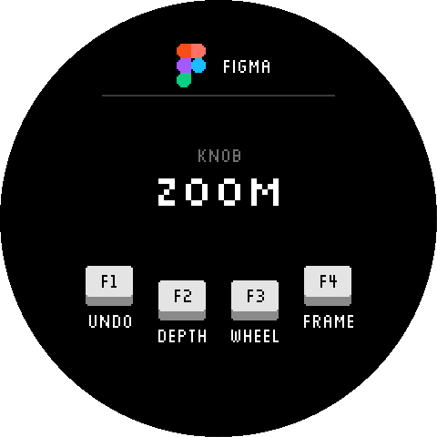
  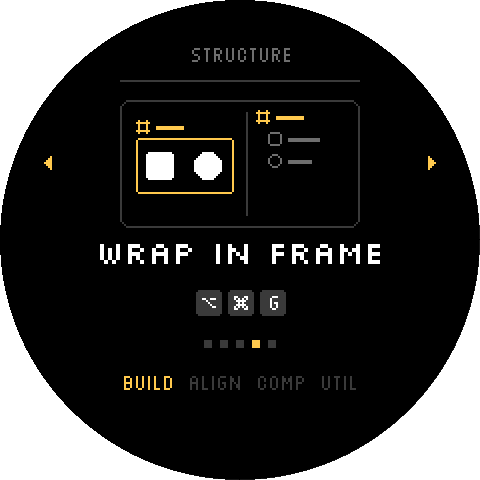
  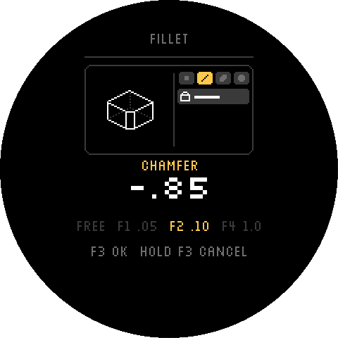
  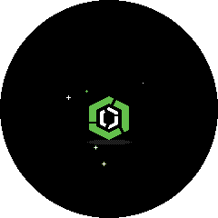
</p>

Every screen in this README is rendered by the firmware's own drawing code through the host
preview tool (`NanoDepsidf/tools/ui_preview`), so what you see is exactly what the display
shows, at 2× scale.

---

## Contents

- [Features](#features)
- [First calibration](#first-calibration) ⚠️ read before first use
- [Using Quadra](#using-quadra)
  - [Keys and knob](#keys-and-knob)
  - [The settings menu](#the-settings-menu)
  - [APP mode and profiles](#app-mode-and-profiles)
  - [Figma](#figma)
  - [Plasticity](#plasticity)
  - [Onshape](#onshape)
  - [Blender and AutoCAD](#blender-and-autocad)
  - [The command wheel](#the-command-wheel)
  - [Parameter mode](#parameter-mode)
  - [Idle screen](#idle-screen)
  - [LEDs](#leds)
- [Hardware](#hardware)
- [Firmware architecture](#firmware-architecture)
- [Building and flashing](#building-and-flashing)
- [Tools](#tools)
- [Desktop companion](#desktop-companion)
- [Writing an app profile](#writing-an-app-profile)
- [Repository layout](#repository-layout)
- [Status and roadmap](#status-and-roadmap)

---

## Features

- **Programmable haptics.** Field-oriented control of a BLDC motor at 10 kHz, with three
  force laws:
  - **SAW:** crisp detents with an electrical click pulse.
  - **SINE:** a smooth bump.
  - **VISCOSE:** pure velocity damping, no detents.

  Detent count, stiffness (Kp) and damping (Kd) are adjustable live. Lists end in a
  **haptic wall**: the knob pushes back instead of clicking past the end.
- **Audible clicks.** Every detent plays a synthesised click through an I²S amplifier and
  transducer, with adjustable pitch and amplitude. Two timbres exist (WOOD, THUD); choosing
  one is hidden from the menu for now, and the saved one plays. Fine-adjustment
  clicks sound an octave higher so you can hear which mode you are in.
- **USB composite device:**
  - a keyboard, mouse and gamepad HID interface;
  - a vendor HID data channel, used for icon upload;
  - a CDC serial console.

  There is no host software to install; the computer sees a keyboard and a mouse.
- **APP mode with app profiles.** Each supported application is one data file describing
  what the knob and keys send, how the knob feels while doing it, and what the screen shows.
  Figma, Plasticity and Onshape ship today. Blender and AutoCAD are listed as empty profiles
  (the knob scrolls) until they are designed.
- **Command wheel.** Hold a key, turn to pick a command, release to run it. Each command has
  a small animated illustration of what it does.
- **Parameter mode.** After a modelling command starts, the knob sets its value: fine clicks,
  or exact 0.05 / 0.10 / 1.00 steps. In Plasticity you can constrain to the X, Y or Z axis;
  in Onshape the knob steps the dialog's number field 0.01 / 0.1 / 1.0 at a time. Then
  confirm or cancel.
- **Pixel UI.** A console-style interface on a round display: crisp whole-pixel graphics, a
  pixel font, and animated transitions. Screen rotation is selectable for holding the device
  in any orientation.
- **Idle screen.** Arcade attract mode: the active app's icon (or the QUADRA wordmark)
  jumps around or explodes onto the screen with squash and stretch, dust, debris and
  sparkles, in that app's colours. A routine is picked at random each time.
- **LEDs in the app's colours.** A 60-LED ring around the knob and two LEDs under each key:
  a dim gradient at rest, a spot that follows the knob and pulses on every detent, the
  command wheel's segments, a flash at an end stop. Never above 20% brightness.
- **Icon upload.** Send any 48×48 image over USB to show on the main screen (RAM only).

---

## First calibration

> ⚠️ **Before using a new or erased device.** The motor has to learn how the magnetic
> sensor lines up with its coils. Until it has, the knob has no haptics. Calibration runs
> once, by itself, and takes about two seconds, but **the knob must be free to turn while it
> runs.**

### How to run it

1. **Place the device on the desk with nothing touching the knob.** Don't hold, press or
   rest a finger on it.
2. **Plug in USB.** Keep your hands off the keys; some key combinations held at power-on
   start other modes (see below).
3. **Wait about 8 seconds.** The firmware waits 3 s, then watches the keys for 3 s, then
   calibrates. During calibration:
   - the knob **snaps to a position** and holds it for about 1 s (alignment);
   - then it **makes a small, visible step** (direction check).
4. **Turn the knob.** Crisp detents mean it worked. The result is saved in flash (NVS,
   namespace `foc_cal`) and reused on every later boot, so it never runs again on its own.

If the knob stays limp with no detents, calibration was rejected, usually because the knob
was held and didn't move during the step. Nothing is saved in that case. Unplug, keep your
hands off, and plug in again to retry.

With a serial monitor attached (`pio device monitor`), a good run logs
`calibration OK: direction=±1, offset=…` then `calibration saved to NVS`. A failed one logs
`rotor didn't move during step`.

### When to calibrate again

Only after a **hardware change**: the magnet, the sensor, the motor or its wiring was
removed, moved or replaced. Firmware updates don't need it; the saved calibration survives
reflashing. The knob-direction setting (`KNOB_DIRECTION`) is unrelated to calibration.

### How to force a new calibration

- **From the menu: DEVICE → RECALIBRATE.** The easiest way.
  1. Open the menu (F4, or hold F4 in APP mode), go to **DEVICE → RECALIBRATE** and press
     **F1**. The button fills amber and asks you to take your hands off the knob.
  2. Press **F1 again** to start (F3 or turning the knob cancels). The motor switches off,
     the saved calibration is forgotten and the device restarts.
  3. It then calibrates exactly like a first boot (the knob twitches briefly), saves the
     result and goes straight back to normal use. No replug needed.
- **F1 + F2 at power-on (diagnostic mode).**
  1. Hold **F1 and F2**, plug in USB, and keep holding for at least 6 s.
  2. The device calibrates afresh, ignoring the saved result, and saves the new one.
  3. It then runs a **bench test**: the knob moves by itself through 30 positions, about
     1.5 s each (about 45 s in all). Keep your hands off.
  4. **Unplug and plug in again** to return to normal use with the new calibration.
- **Erase the flash** (`pio run -t erase`, then flash again). The next boot is a first boot
  and calibrates as above. This also **resets every saved setting** (haptics, profiles,
  display, boot mode).

Other key combinations held at power-on:
- **F3 + F4** is the USB recovery mode (see [Building and flashing](#building-and-flashing)).
- **F1 alone** runs the same bench test with the saved calibration. **F1 + F3** and
  **F1 + F4** start further motor diagnostics. None of these are needed
  for normal use; if you start one by mistake, unplug and plug in again.

---

## Using Quadra

### Keys and knob

The four keys are **F1, F2, F3 and F4**, from left to right along the bottom of the display.
The screen always shows what each key does, on the key legend at the bottom.

| Input | Main screen, non-APP modes | In the menu |
|---|---|---|
| Knob | Mouse scroll wheel, one step per detent | Move the selection / change a value |
| F1 | — | Select, or start / confirm an edit |
| F2 | — | Save the current screen |
| F3 | — | Back / cancel an edit |
| F4 | Open the menu | Close the menu |

In APP mode the keys belong to the application (see below), and **holding F4 for 0.7 s
opens the menu** instead.

### The settings menu

<p>
  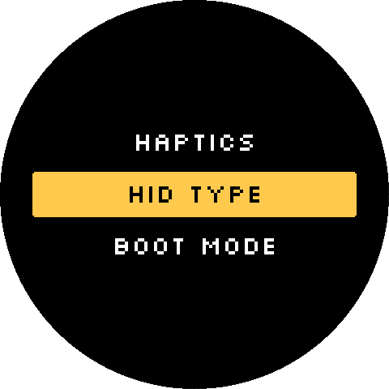
  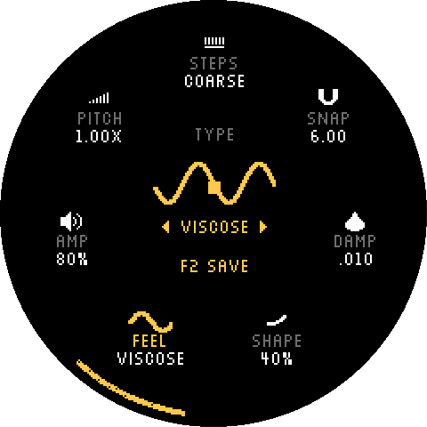
  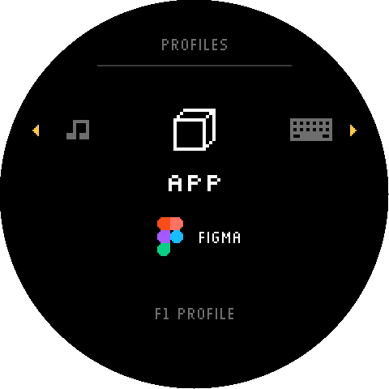
  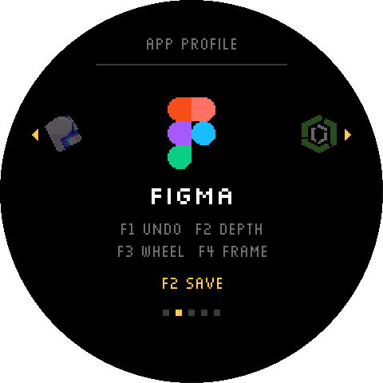
  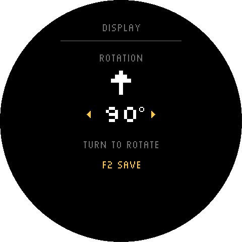
  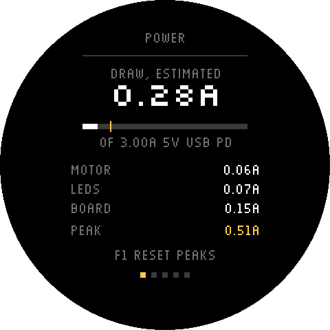
  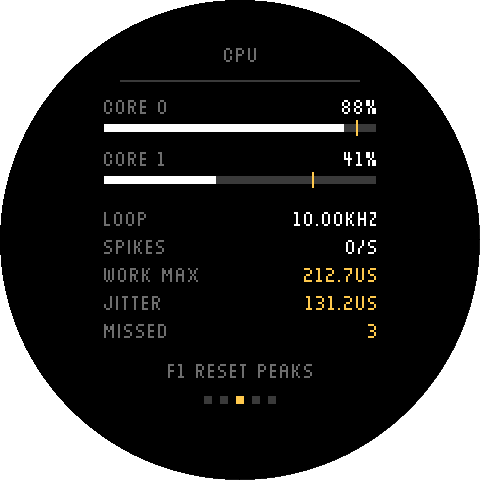
  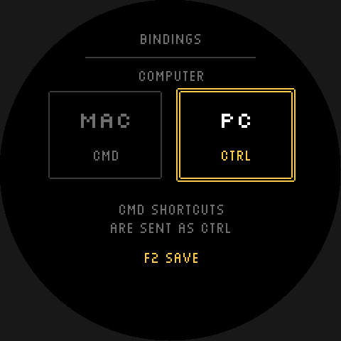
</p>

| Screen | Settings |
|---|---|
| **PROFILES** | APP, KEYBOARD, MOUSE or MIDI. With APP, F1 opens **PROFILE**, a carousel of the installed app profiles. With MIDI, F1 moves to the channel. |
| **HAPTICS** | STEPS picks a haptic profile: WIDE, COARSE, MEDIUM or FINE (8, 12, 24 or 36 detents per turn) or SMOOTH (no steps). Each profile keeps its own FEEL (SAW / SINE / VISCOSE; SMOOTH is VISCOSE only), SNAP (Kp), DAMP (Kd), SHAPE (how late and steep SAW's pull rises), AMP and PITCH, within safe limits for that profile and feel. An item that doesn't apply in the current feel shows `--`. Changes are live while you tune; F2 saves; holding F2 for 1.5 s puts the shown profile back to factory. |
| **DISPLAY** | ROTATION: 0°, 90°, 180° or 270°. The screen turns live while you turn the knob. |
| **BOOT MODE** | USB MODE: HID (the normal composite device) or SERIAL (for flashing). Applies after a restart. |
| **DEVICE** | **SYS INFO**: live readings on five pages, turn to move between them, F1 resets the peaks and counters. POWER: estimated draw (motor, LEDs, board) against what the USB-C / PD chip negotiated at boot. HEAT: chip temperature, motor coil current and heat. CPU: load per core, control-loop rate, spikes per second, worst compute time, jitter, missed ticks. LOOP: where one control iteration's time goes (input, sensor, force, motor), plus sensor CRC errors. SYSTEM: free RAM, dropped HID reports, audio gaps, uptime. **BINDINGS**: MAC or PC. Profiles are written with Mac shortcuts; on PC every Cmd is sent as Ctrl (Option is Alt on both). Switches as you turn, F2 saves. **RECALIBRATE**: F1, then F1 again, restarts and recalibrates the motor (see [First calibration](#first-calibration)). |

Screens with a single choice (PROFILES, DISPLAY, BOOT MODE, BINDINGS) change the value directly as you
turn. Leaving without F2 puts the saved value back. Saved settings live in NVS flash and
survive power cycles.

### APP mode and profiles

APP is the default HID type. The status bar shows the active app's icon and name, and the
keys and knob drive that application. Profiles are chosen in **PROFILES → PROFILE**.

The knob's feel follows what it is doing. Smooth drags (orbit, pan, zoom) run VISCOSE.
Stepped actions (undo history, layers, frames) click once per step.

### Figma

<p>
  
  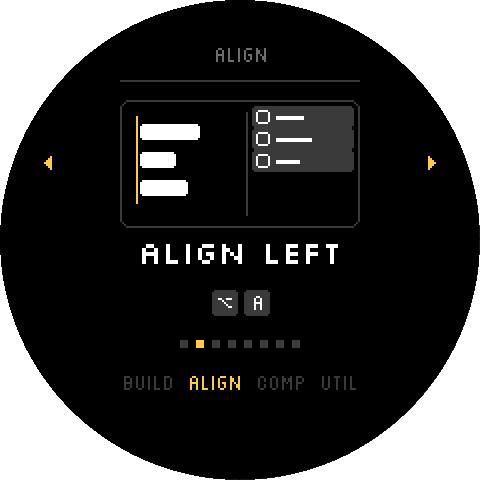
  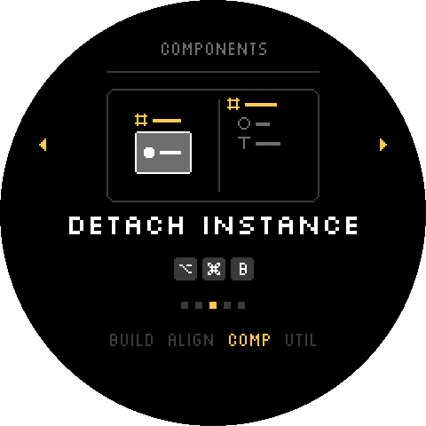
  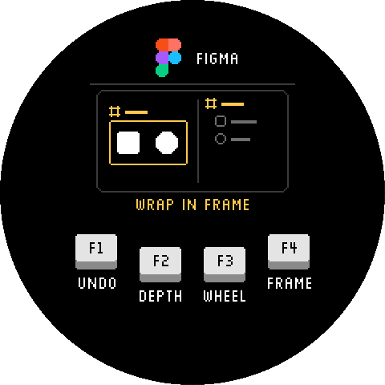
</p>

| Input | Tap | Hold + turn |
|---|---|---|
| Knob alone | — | Zoom (⌘ + wheel) |
| F1 | Undo | Undo / redo, one history step per detent |
| F2 | Zoom to selection | **Depth:** clockwise selects children (↵), counter-clockwise the parent (⇧↵) |
| F3 | — | **Command wheel** |
| F4 | Long press: menu | Next / previous frame (N / ⇧N) |

**Wheel rings (F3):**
- **STRUCTURE:** add or remove auto layout, wrap in frame, group.
- **ALIGN:** left, centre, right, top, middle, bottom, tidy up.
- **COMPONENTS:** create component, detach instance, go to main component, reset instance.
- **UTILITY:** copy and paste properties, rename, run last plugin.

Commands without a shortcut go through Figma's Actions search (⌘K, type, Enter).

Shortcuts assume macOS and a US keyboard layout.

### Plasticity

<p>
  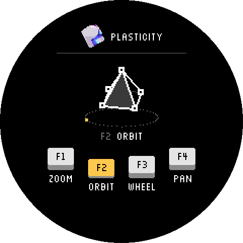
  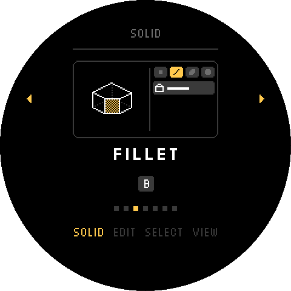
  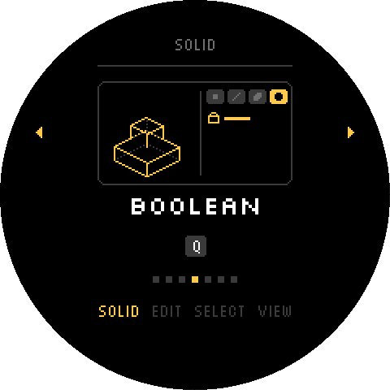
  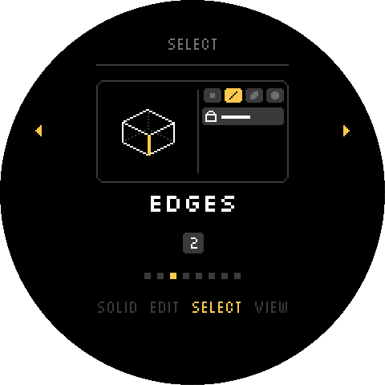
</p>

| Input | Tap | Hold + turn |
|---|---|---|
| Knob alone | — | Zoom (continuous: Ctrl + middle-drag) |
| F1 | — | Zoom |
| F2 | — | Orbit (middle-drag) |
| F3 | Undo (⌘Z) | **Command wheel** |
| F4 | Long press: menu | Pan (right-drag) |

The main screen shows a small isometric pyramid chained to the knob. It turns one-for-one
with orbit, zooms through nested copies, slides with pan, and flashes on undo. After an
orbit it settles to the clean 45° isometric pose.

**Wheel rings (F3):**
- **SOLID:** extrude, fillet, boolean, cut, offset face, hollow.
- **EDIT:** move, rotate, scale, duplicate, mirror, delete.
- **SELECT:** control points, edges, faces, solids, all types, select all, invert.
- **VIEW:** front, right, top, perspective, focus, isolate, unisolate.

Keys follow Plasticity's defaults from the [Plasticity manual](https://doc.plasticity.xyz/all-commands).
Commands without a default key use the command palette (F, type, Enter).

### Onshape

<p>
  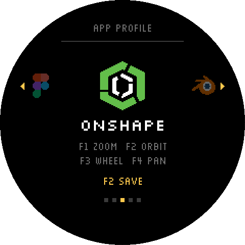
  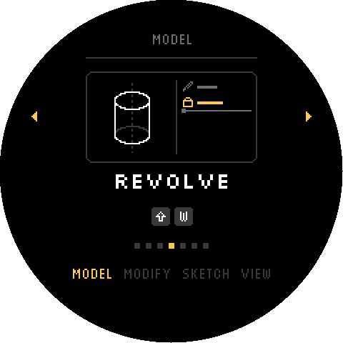
  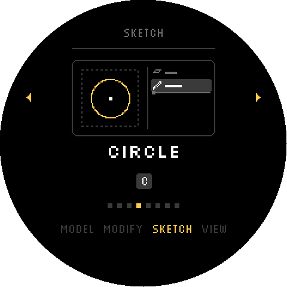
  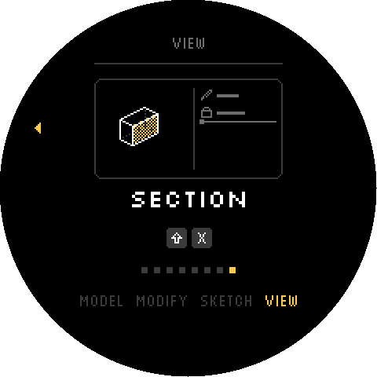
</p>

Onshape runs in the browser, so keys land only while its tab has focus. Navigation follows
Onshape's default mouse: right-drag rotates, middle-drag pans, and the scroll wheel zooms.

| Input | Tap | Hold + turn |
|---|---|---|
| Knob alone | — | Zoom, one scroll notch per detent |
| F1 | — | Zoom |
| F2 | — | Orbit (right-drag) |
| F3 | Undo (⌘Z) | **Command wheel** |
| F4 | Long press: menu | Pan (middle-drag) |

The main screen shows the same knob-driven isometric shape as Plasticity, as a cube.

**Wheel rings (F3):**
- **MODEL:** sketch, extrude, revolve, fillet, chamfer, shell.
- **MODIFY:** boolean, split, transform, linear pattern, mirror, move face.
- **SKETCH:** line, rectangle, circle, arc, dimension, trim, construction. These are
  Onshape's single-letter sketch keys, which work only while a sketch is open.
- **VIEW:** front, right, top, isometric, normal to, zoom to fit, section.

Cards show Onshape's feature list on the right, with the new feature above the rollback
bar. Keys follow Onshape's
[keyboard shortcuts](https://cad.onshape.com/help/Content/Home/keyboard_shortcuts_and_hotkeys.htm).
Tools without a default key go through tool search (⌥C, type, Enter).

### Blender and AutoCAD

<p>
  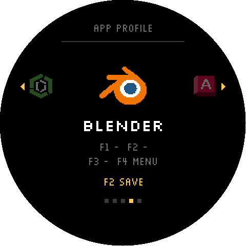
  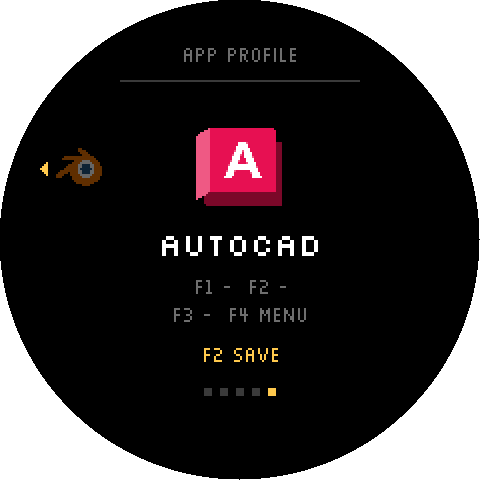
</p>

Both are in the profile list with their icons, but not designed yet: they use the **empty
template**. The knob scrolls as it does outside APP mode, F1–F3 do nothing, and holding F4
opens the menu. Their own controls will come in later profiles; both work differently from
the Plasticity / Onshape pair.

### The command wheel

Hold the wheel key (F3) and the screen turns into a carousel of commands:
- **One detent per command.** Clockwise moves to the next.
- **× at the start of every ring** cancels.
- **A haptic wall at both ends.**
- **Release to run** the command.
- **Opens on the last command you used,** so a quick hold-and-release repeats it.
- **Switching rings:** while the wheel is open, F1, F2 and F4 jump between rings. A key
  bound to two rings (F1 in every profile) steps through them.

Each command has a **card**: a 120×64 illustration of what it does, animated in a loop. In
Figma a card is a mini canvas plus layers panel. In Plasticity it is a wireframe isometric
viewport, the selection-mode strip and the outliner. In Onshape it is the same viewport
(or a flat sketch) beside the feature list. Cards are not stored as images. They are short
scene descriptions (shapes, rows and keyframes) drawn at runtime, so 71 animated cards cost
about 30 KB of flash in total. After a command runs, the main screen replays its
card for a moment with the name in amber.

On a key that also has a tap action (Plasticity's F3 = undo), the wheel only appears after
you hold it for 250 ms, so a quick undo never flashes it on screen.

### Parameter mode

<p>
  
  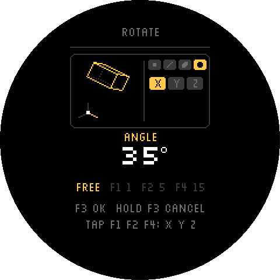
  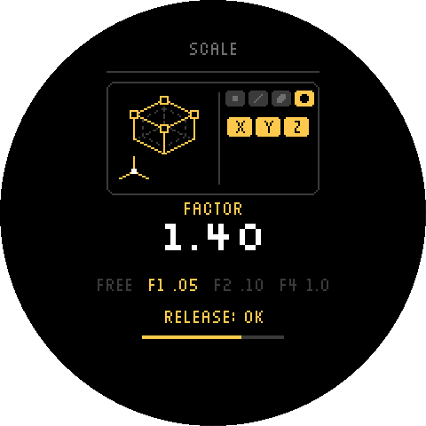
</p>

Running **fillet, extrude, offset face, hollow, move, rotate or scale** from the Plasticity
wheel turns the screen into that command's value dial. The card follows the value live.

| Input | Does |
|---|---|
| Knob alone | **Free:** fine clicks (48 per turn, higher-pitched). Each click nudges the value and moves the pointer, so Plasticity's own handle follows. |
| Hold F1 / F2 / F4 + turn | **Exact** steps of 0.05 / 0.10 / 1.00 (rotate: 1° / 5° / 15°), one click each. The value is typed in on confirm. |
| Tap F1 / F2 / F4 | Constrain to **X / Y / Z** (move, rotate, scale). Tap the active one again for its plane (⇧X…), and for scale again for uniform (S). |
| Tap F3 | Confirm |
| Hold F3 (0.6 s) | Cancel (Esc); a bar fills while you hold |

**Fillet:** turning right makes a fillet, turning left a chamfer. That is Plasticity's own
sign convention.

**Limits:** values with a minimum (hollow thickness, scale factor) stop at a haptic wall.

**Defaults:** move starts on X, rotate on Z, and scale is uniform. Each command remembers
the last constraint you used.

#### Onshape: the number field

<p>
  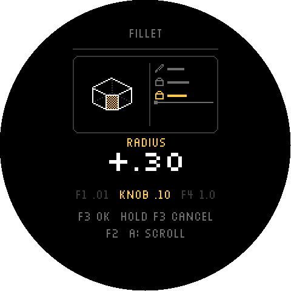
  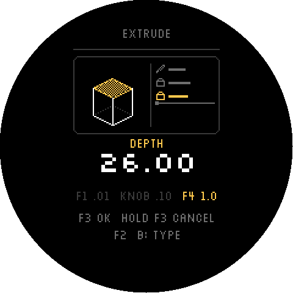
</p>

Running **extrude, fillet, chamfer, shell, move face or transform** from the Onshape wheel
opens the same dial. Onshape has no handle to drag, so the knob drives the dialog's number
field. That field steps 0.1 per scroll notch, 0.01 with Ctrl and 1.0 with Shift.

| Input | Does |
|---|---|
| Knob alone | Steps of **0.1**, one click each |
| Hold F1 + turn | Steps of **0.01**, as fine clicks (48 per turn, higher-pitched) |
| Hold F4 + turn | Steps of **1.0** |
| Tap F2 | Switch between **A** and **B** (remembered) |
| Tap F3 | Confirm (Enter) |
| Hold F3 (0.6 s) | Cancel (Esc) |

The two ways the value reaches Onshape:
- **A, scroll (the default).** Point at the field. Each click is one scroll notch, with Ctrl
  or Shift held for the step, and Onshape updates its own preview. The device can't read the
  field, so the screen shows the change (+.30) and there are no limits.
- **B, type.** The device keeps the value. When the knob rests, it selects the field (⌘A)
  and types the value. The screen shows the value, with haptic walls at the limits.

### Idle screen

<p>
  
  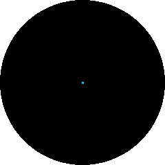
  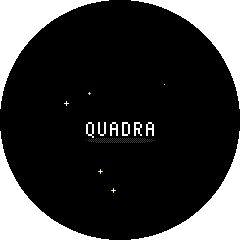
</p>

These animations are recorded from the firmware's own drawing code (JUMP with Onshape, BOOM
with Figma, JUMP with the QUADRA wordmark), at 20 fps; the device runs them at its full frame
rate.

After 5 s without input the screen goes into an arcade-style attract mode: the active app's
48×48 icon, or the QUADRA wordmark outside APP mode, performs a routine. The first is picked
at random every time the device goes idle, and when it finishes, a different one follows.

- **Jump.** Never leaves the screen: two small hops, a crouch and a big jump with
  afterimages, a hard landing (squash, screen shake, dust, debris), a gleam, hops left and
  right, a spinning jump, then it breathes with sparkles around it.
- **Boom.** A fuse blinks, a pixel explosion goes off (white core, a ring in the app's
  colours, smoke, debris, a hard shake), the icon pops out with a springy overshoot, bobs
  over its shadow with sparkles, then implodes into a flash.

A third routine, **Bounce** (the icon rattling around inside the glass like a pinball), is
built but switched off. Set `ROUTINE_ON[ATTRACT_BOUNCE]` to `true` in `src/ui_fx.cpp` to put
it back into the rotation.

Everything is whole pixels; squash and stretch scale the icon nearest-neighbour. Accents
(sparks, the explosion ring, sparkles) use the app's colours: Figma's purple, blue and
green, Onshape's teal, green and lime, and for other profiles the three most common colours
of the icon. QUADRA uses amber. Any input wakes the device, and the waking key press is
swallowed.

### LEDs

A ring of 60 LEDs sits around the knob and two LEDs sit under each key. They take the same
three colours as the idle screen (the app's accents, amber outside APP mode and in the menu)
and never go above 20% brightness.

| When | Ring around the knob | Key LEDs |
|---|---|---|
| At rest | A dim gradient of the app's three colours | Dim, in the same gradient from F1 to F4; a key with no action is nearly off |
| Turning the knob | A bright spot follows the knob and pulses on every detent click; it fades back into the gradient about a second after the knob stops | — |
| Holding a key | — | That key lights up fully |
| Command wheel open | One segment per command (cancel first, dim white); the chosen one is bright | — |
| End stop | A short white flash of the whole ring | — |
| Menu | Amber | Amber |
| Idle | The gradient drifts slowly and dims | Dimmed |

The animations are deliberately calm: 30 updates a second, and a strip is only sent again
when one of its LEDs changes. A software cap also scales everything down if the estimated
draw would pass 250 mA.

---

## Hardware

| Part | Details |
|---|---|
| MCU | ESP32-S3 (dual core, 240 MHz), 4 MB flash, 2 MB PSRAM, native USB |
| Motor | 3-phase BLDC, 7 pole pairs, driven by an STSPIN233. Voltage-mode FOC (no current sensing), MCPWM at 32 kHz. |
| Position sensor | MT6701 magnetic encoder, SSI over SPI |
| Display | GC9A01 round IPS, 240×240, SPI at 80 MHz, PWM backlight |
| Audio | MAX98357A I²S amplifier driving a transducer |
| Keys | 4 (F1–F4), active low |
| LEDs | WS2811: a 60-LED ring around the knob (RGB order) and 8 under the keys, two per key (GRB order), driven over RMT |
| USB power | Asks the host for 500 mA, the USB 2.0 maximum; an STUSB4500 (I2C 0x28 on GPIO 12 / 13) negotiates USB-C / PD power on its own. The firmware only reads it, once at boot, and shows the result under DEVICE → SYS INFO |
| USB | USB-C, native USB OTG (TinyUSB) |

<details>
<summary>Pin map (<code>NanoDepsidf/src/board_pins.h</code>)</summary>

| Function | GPIO |
|---|---|
| Motor EN U / V / W | 33 / 48 / 36 |
| Motor IN U / V / W | 34 / 35 / 37 |
| MT6701 DO / CLK / CS | 21 / 18 / 17 |
| Display MOSI / SCLK / CS / DC / RST / BL | 4 / 3 / 6 / 7 / 2 / 5 |
| I²S DOUT / BCLK / LRC | 9 / 10 / 11 |
| Keys F1 / F2 / F3 / F4 | 41 / 40 / 45 / 46 |
| LED ring A / B | 38 / 42 |
| I²C SDA / SCL | 12 / 13 |
| UART2 RX / TX | 44 / 43 |

</details>

---

## Firmware architecture

The firmware is ESP-IDF 6.1, built with PlatformIO. It is written in C for the real-time
and model code, and C++ for the display. This section is a summary; the full technical
description is in [`NanoDepsidf/docs/FIRMWARE.md`](NanoDepsidf/docs/FIRMWARE.md).

**Core split.** Core 0 runs only the control loop: FOC, sensor reads, haptics, key reads and
input mapping. Core 1 runs everything that can tolerate latency:

| Task | Core | Priority | Job |
|---|---|---|---|
| `control` | 0 | 20 | 10 kHz FOC + haptic loop, key debounce, menu input, APP-mode engine |
| `usb` | 1 | 12 | Brings the host in line with the wanted HID state every tick |
| TinyUSB device task | 1 | 11 | The USB stack itself (kept above the display so animations never delay reports) |
| `i2s` | 1 | 9 | Click synthesis and audio output |
| `display` | 1 | 9 | Renders frames into a full-screen sprite and pushes them over SPI |
| `led` | 1 | 10 | LED ring and key LEDs at 30 fps; above the display so its animations can't stall it, asleep between frames |
| `pd` | 1 | 10 | One-shot at boot: reads the STUSB4500's contract over I2C (read-only), then exits |
| `sysmon` | 1 | 10 | SYS INFO: samples load, loop timing, temperature and the power estimate twice a second; logs a line every 5 s |
| `menu_save` | 1 | 10 | Runs F2's save to flash, so it never happens inside a control-loop tick |

**Timing.** A hardware timer interrupt wakes the control task every 100 µs. One iteration takes
about 26 µs on average and 42 µs at worst, with 5 µs of jitter and no missed ticks (measured
on hardware through DEVICE → SYS INFO). To get there, everything the loop runs sits in
internal RAM (IRAM) instead of flash: the loop's own functions, the FreeRTOS, SPI, PWM and GPIO
code it calls, and the C library's `sinf` / `cosf`. From flash, that code shared a cache with
Core 1 and stalled whenever Core 1 was busy. A write to flash (saving settings or a profile)
still pauses both cores briefly while the chip writes.

**Knob direction.** Which way counts as forward is one constant, `KNOB_DIRECTION` in
`control_task.c` (currently inverted, -1). It flips what a turn means everywhere (menu, APP
mode, the scroll wheel, end stops) while the motor and haptic maths stay in sensor
coordinates.

**Haptics.** Each tick reads the encoder and finds the nearest detent, with hysteresis. It
then applies the selected law: a SAW spring with a click pulse, a SINE bump, or VISCOSE
damping. Fast flicks coast torque-free. End stops refuse the next detent and pull back with a
stiffer spring that starts continuously from the switch point.

**State, not events.** The control task never queues USB press/release events. It publishes
what the host *should* see: held buttons and modifier, pending pointer travel and wheel
steps, and a ring of key taps. The USB task keeps sending until the host matches, so a
report lost to a busy endpoint can never leave a key or button stuck down.

**App profiles are data.** `src/app_profiles/` holds one C file per application. A profile
declares:
- the slots (knob, F1–F4), each with an action (drag, wheel, keys, tap or command wheel), a
  feel and a detent count;
- a quick-tap action per key;
- the command rings and their commands;
- each command's card, as scene data;
- optional parameter specs.

The engine (`src/app_mode.c`) knows nothing about any particular app.

**Rendering.** One 240×240 RGB565 sprite in internal RAM is fully redrawn and pushed with
LovyanGFX: about 1 ms to draw and 12 ms to push. Frames are produced only when something
changes, or while an animation runs. Everything is whole pixels, with no anti-aliasing:
- a black background with a four-colour palette (white, grey, dark, amber), where app icons
  are the only full-colour exception;
- a Silkscreen-derived pixel font;
- 1-bit sprites, sometimes scaled by whole numbers.

---

## Building and flashing

**Requirements:** [PlatformIO](https://platformio.org/) (CLI or the VS Code extension). The
ESP-IDF, TinyUSB and LovyanGFX dependencies download on the first build.

```sh
cd NanoDepsidf
pio run                                        # build
pio run -t upload --upload-port <port>         # flash
pio device monitor                             # serial console, 115200 baud
```

In normal operation the device enumerates as a composite HID + CDC device, and uploads use
the CDC port's 1200-baud reset. If an upload can't find the device:

- **Hold F3 + F4 while powering on.** For that boot, the device skips the HID device and
  stays in the ESP32-S3's plain USB serial/JTAG mode, which the uploader can always reach.
  This takes priority over every saved setting.
- Or set **BOOT MODE → USB MODE → SERIAL** in the menu and restart.

The board definition is `NanoDepsidf/boards/nanofoc_d.json`, and the partition table
`boards/nano_partitions.csv` has two OTA slots of 1.25 MB each, NVS and a 1.4 MB data
partition that holds stored profiles. Motor calibration runs on first boot and is cached in NVS; see
[First calibration](#first-calibration) before the first use of a new or erased board.

---

## Tools

All Python tools use one virtualenv:

```sh
python3 -m venv NanoDepsidf/tools/.venv
NanoDepsidf/tools/.venv/bin/pip install -r NanoDepsidf/tools/requirements.txt
```

| Tool | What it does |
|---|---|
| `tools/ui_preview/run.sh [out.png]` | Compiles the firmware's UI code for the host against a small graphics stub and renders every screen into one PNG contact sheet: menus, wheels, every command card, parameter dials, the idle screen. No hardware needed. |
| `tools/profile_json_test/run.sh` | Builds the profile JSON code for the host and checks it: every built-in profile survives a round trip unchanged, and bad input is refused with a reason. |
| `tools/send_icon.py` | Uploads a 48×48 image to the device over the vendor HID interface (`icon.png`, `--test-pattern`, `--clear`, `--list`, `--dry-run --preview out.png`). |
| `tools/gen_icon_c.py` | Converts a PNG into an RGB565 C array for a profile icon (24×24 status bar, 48×48 profile screen and idle screen). |
| `tools/gen_silkscreen_font.py` | Regenerates the pixel fonts in `src/fonts/` from Silkscreen. |

---

## Desktop companion

<p>
  
  
</p>

`companion/` is a macOS app (Tauri, about 4 MB) that reads the knob live and changes its
settings from the computer, in the device's own pixel style:

- **The glass:** a live mirror of the device. It shows the LED ring with the knob's spot, the
  detents, the active app or mode, and F1–F4.
- **HAPTICS:** the haptic profiles (STEPS), and each one's FEEL and SNAP, DAMP, SHAPE, AMP and PITCH sliders.
- **PROFILES:** the mode and the built-in app profiles, with their icons.
- **DEVICE:** BINDINGS, rotation, boot mode and the firmware version.
- **SYS INFO:** power, heat, CPU and system, with a minute of history.

Changes are live on the knob; **SAVE** stores them, just as F2 does. The same UI also runs as
a web page in Chrome or Edge over WebHID. It talks to the vendor HID interface with the small
protocol in `src/host_proto.h`, so it needs no driver.

```sh
cd companion && pnpm install
pnpm tauri dev                 # the app
pnpm dev                       # the page (open http://localhost:1420; add ?demo for a simulated knob)
pnpm tauri build               # Quadra.app
```

Every screen is covered in the [user guide](companion/docs/COMPANION.md). Building, WebHID and
notarizing are covered in [`companion/README.md`](companion/README.md).

---

## Writing an app profile

1. **Add the file.** Create `src/app_profiles/<app>.c` defining a `const app_profile_t`, and
   add one line to the registry in `app_profiles.c`. No build changes are needed; `src/` is
   globbed. The quickest start is the empty template, which gives a working profile where the
   knob scrolls and holding F4 opens the menu (as `blender.c` and `autocad.c` do today):

   ```c
   const app_profile_t app_profile_blender =
       APP_PROFILE_EMPTY_ICON("blender", "BLENDER", app_icon_blender_24, app_icon_blender_48);
   ```

   `APP_PROFILE_EMPTY(id, name)` does the same with a placeholder icon.

   The registry checks each profile once before use (version, names, legends, slots, rings,
   commands, scenes). A profile that fails, or a missing entry, is replaced by the same empty
   template, shown as EMPTY, so a mistake can never crash the device.
2. **Add icons.** Draw a 24×24 and a 48×48 icon (`tools/icons/<app>_pixel_{24,48}.png`) and
   convert them with `gen_icon_c.py`.
3. **Fill in the slots.** A turn action is a drag (mouse buttons + modifier + pointer axis), a
   wheel, or keys (one shortcut per detent, clockwise and counter-clockwise). A key can also
   have a quick-press `tap`:

   ```c
   [APP_SLOT_F1] = {
       .kind = APP_ACT_KEYS, .label = "UNDO/REDO",
       .cw = {CMD | SHIFT, HID_KEY_Z}, .ccw = {CMD, HID_KEY_Z}, .tap = {CMD, HID_KEY_Z},
       .feel = HAPTIC_TYPE_SAW, .detents = 12,
   },
   ```

4. **Optional: a command wheel.** Set a slot to `APP_ACT_COMMANDS` and define `rings`. Each
   command is a shortcut, or a phrase typed into the app's search (`.search`). It has a
   `scene` for its card: a list of keyframes, each a handful of elements such as
   `EL_BOX`, `EL_FRAME`, `EL_ROW` (outliner rows), `EL_ISO` (isometric boxes) or `EL_MODES`:

   ```c
   SCENE(SC_EXTRUDE,
         KEYFRAME(600, EL_ISO(32, 40, 16, 16, 0, APP_ISO_FACE), EL_MODES(M_FC), ...),
         KEYFRAME(1300, EL_ISO(32, 35, 16, 16, 14, APP_ISO_FACE), EL_MODES(M_FC), ...));
   ```

5. **Optional: parameter mode.** Give a command an `app_param_t` with its label, steps,
   limits, the key that puts the app into value entry, axis options and a visual. Set the
   profile's `param_keys`: numeric entry, confirm, cancel, the X / Y / Z keys and uniform.
   For an app with number fields instead of handles, set `.field = true` with the modifier
   for each step (`step_mod`), the scroll direction and a select-all key, as Onshape does.
6. **Check it.** Render with `tools/ui_preview/run.sh`; every card and dial shows up in the
   contact sheet.

`figma.c`, `plasticity.c` and `onshape.c` are complete worked examples.

---

## Repository layout

```
NanoDepsidf/                   the firmware (PlatformIO project)
├── platformio.ini
├── sdkconfig.defaults         ESP-IDF settings (CPU 240 MHz, watchdog, TinyUSB, IRAM placement, ...)
├── control_hot.lf             linker fragment: the control loop's C-library maths in IRAM
├── boards/                    board definition + partition table
├── src/
│   ├── main.c                 boot: USB mode select, task start-up
│   ├── control_task.c         10 kHz FOC + haptics loop, keys, menu input (Core 0)
│   ├── motor_driver.c, foc_*.c, mt6701.c    motor, FOC maths, calibration, encoder
│   ├── app_mode.c             APP-mode engine: slots, command wheel, parameter mode
│   ├── app_profiles/          one file per app + icons
│   ├── usb_task.c             TinyUSB composite device, HID state sync
│   ├── icon_store.c           vendor-HID icon upload protocol
│   ├── host_link.c, host_proto.h            the desktop companion's protocol (same interface)
│   ├── sysmon.c               SYS INFO: load, loop timing, heat, estimated power
│   ├── i2s_task.c, audio_trigger.c          click synthesis
│   ├── menu.c, config_store.c               settings menu + NVS persistence
│   ├── profile_store.c        stored profiles (LittleFS)
│   ├── display_task.cpp       view state, transitions, frame pacing
│   ├── ui_gfx.cpp             pixel primitives, font, sprites
│   ├── ui_screens.cpp         every screen's layout
│   ├── ui_cards.cpp           command cards, wheel, parameter dials (scene renderer)
│   ├── ui_shape.cpp           the CAD profiles' isometric micro-interaction
│   └── ui_fx.cpp              boot animation, idle screen (arcade attract mode)
├── tools/                     host tools (see above)
└── docs/
    ├── FIRMWARE.md            technical documentation: how the firmware works
    └── images/                README screens (rendered by tools/ui_preview)

companion/                     the desktop app (Tauri + TypeScript; see companion/README.md)
```

---

## Status and roadmap

**Working and confirmed on hardware:**
- FOC and haptics, with end stops.
- Audio clicks.
- The USB composite device.
- The settings menu with persistence, and display rotation.
- APP mode with the Figma, Plasticity and Onshape profiles, their command wheels, and
  parameter mode (Plasticity's handle, Onshape's number field).
- The idle screen, icon upload, and the pixel UI.
- The LED ring and key LEDs.
- Knob direction, menu order, click amplitude (AMP), and the Jump / Boom idle routines.
- The USB power reading (5 V 3 A over USB-C PD from a Mac) and DEVICE → SYS INFO.
- A fast, steady control loop: 10.00 kHz, about 26 µs per iteration on average and 42 µs at
  worst of a 100 µs budget, 5 µs of jitter, no missed ticks and no spikes.

**Milestone 1 (in progress):**
- DEVICE → RECALIBRATE (built, not yet confirmed on hardware).
- DEVICE → BINDINGS, MAC / PC: Cmd sent as Ctrl on a PC (built, not yet confirmed on a
  Windows PC).
- LED power budget scaled from the USB power reading.
- KEYBOARD, MOUSE and MIDI modes.
- Desktop companion for macOS: live mirror, settings, SYS INFO (built, not yet confirmed
  against the knob). Next: profile editing and upload, automatic profile switching, the Figma
  bridge, Windows.
- Integration tests: first pass done with SYS INFO, and the loop spikes it found are fixed
  (the loop's code now runs from IRAM). Left: the loop's worst case during a save to flash is
  not measured yet, and rare audio gaps.
- Final clean-up.

**Milestone 2:**
- Uploadable profiles stored on the device.
- Automatic profile switching from the frontmost app.
- A Figma plugin for direct value control over HID.

**Known assumptions:**
- Shortcuts are written for **macOS**; on Windows set DEVICE → BINDINGS to PC (Cmd is sent
  as Ctrl). They assume a **US keyboard layout**: HID sends key positions, so other layouts
  can type different characters.
- Uploaded icons are held in RAM and cleared on restart.
