# Quadra companion: user guide

The companion is the desktop app for the Quadra knob. It shows the knob live and lets you
change its settings and app profiles from the computer. This guide is for someone using the
app. For building it, see the [companion README](../README.md); for the protocol and the
firmware side, see [FIRMWARE.md](../../NanoDepsidf/docs/FIRMWARE.md) §10.

The screenshots here are taken in demo mode (a simulated knob), so some values differ from a
real device.

## Contents

1. [Connecting](#1-connecting)
2. [The window](#2-the-window)
3. [Live and saved](#3-live-and-saved)
4. [HAPTICS](#4-haptics)
5. [PROFILES](#5-profiles)
6. [The profile editor](#6-the-profile-editor)
7. [Macros](#7-macros)
8. [LOOK](#8-look)
9. [DEVICE](#9-device)
10. [SYS INFO](#10-sys-info)
11. [When something doesn't work](#11-when-something-doesnt-work)

---

## 1. Connecting

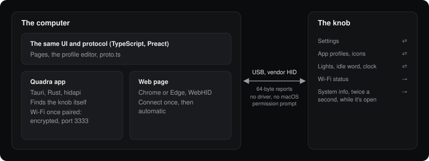

There are two ways to run the companion, with the same screens:

| | Quadra app | Web page |
|---|---|---|
| Runs in | Its own window (macOS) | Chrome or Edge |
| Connecting | Finds the knob itself, and again after a replug; over WiFi once paired | Click **CONNECT** once and pick the knob; automatic after that |
| Safari, Firefox | – | Not supported (no WebHID): the page says **NO USB ACCESS** |

**Over WiFi (the app):** once the knob is on your network (DEVICE → WIFI), press **PAIR THIS
APP** there while it's on USB. From then on, with no cable in, the app reaches it over WiFi
(found by name, `quadra-xxxx.local`); plug a cable in and it moves back to USB within a few
seconds. Pairing hands the app the knob's key: nothing else on the network can read, forge or
replay what goes between them. The network, the password and the key itself change over USB only.

Neither needs a driver, and macOS doesn't ask for Input Monitoring permission.

The knob has to be in **HID** boot mode, which is the normal one. In SERIAL mode (used for
flashing) the companion can't see it.

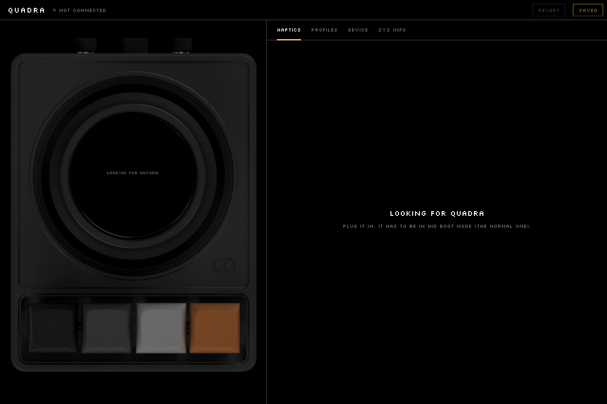

Until a knob answers, the header says **SEARCHING...** and the panel says what to do. Once
connected, the header shows **CONNECTED** and the firmware version.

## 2. The window

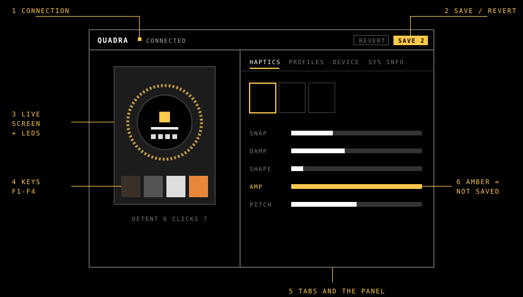

1. **Connection:** the status and the knob's firmware version.
2. **SAVE / REVERT:** for the settings on the HAPTICS, PROFILES, LOOK and DEVICE tabs. SAVE shows
   how many settings differ from what's stored (`SAVE 2`), and reads **SAVED** when none do.
3. **The device:** the knob as it is now. Its screen shows inside the knob, and the LED ring
   glows in the colours the real LEDs show. With firmware that has the extensions (v6) the
   screen is the knob's own, live, and the picture is a remote: click a key (held as long as
   the button is down), drag round the knob or scroll over it to turn it -- the knob reacts as
   if you'd touched it (the volume follows in MUSIC, the zones step in CLOCK).
4. **The keys:** F1–F4 light up and press down while you hold them. Hover over one to see
   what it does in the current profile.
5. **Tabs and the panel:** HAPTICS, PROFILES, LOOK, DEVICE and SYS INFO. LOOK only shows
   with firmware that has the extensions (DEVICE → FIRMWARE → EXTENSIONS).
6. **Amber:** a value that is live on the knob but not stored yet.

Under the device, **DETENT** is the step the knob is on and **CLICKS** counts the steps it has
passed.

## 3. Live and saved

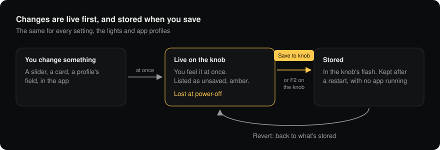

Every change goes to the knob at once, so you feel it while you adjust it. It is stored only
when you save:

- **SAVE** (top right) stores all changed settings. Pressing **F2** in the knob's own menu does
  the same.
- **REVERT** returns every changed setting to what's stored.
- An unsaved change is lost when the knob loses power.

Profiles follow the same rule, with their own **SAVE TO KNOB** and **REVERT** buttons inside
the editor (see [section 6](#6-the-profile-editor)).

## 4. HAPTICS

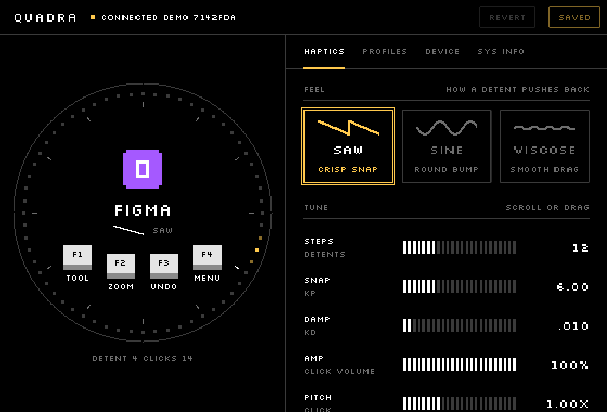

**STEPS** picks a haptic profile. A haptic profile is a complete feel: how far apart the
clicks are, plus its own feel and tuning. Modes and app profiles use these profiles, so a
change here applies everywhere that profile is used.

| Profile | Clicks per turn |
|---|---|
| **WIDE** | 8 |
| **COARSE** | 12 |
| **MEDIUM** | 24 |
| **FINE** | 36 |
| **SMOOTH** | None: a smooth drag |

**FEEL** is how a step pushes back in the chosen profile. Each feel keeps its own tuning, so
switching feel shows that feel's values. SMOOTH offers VISCOSE only.

| Feel | What it's like |
|---|---|
| **SAW** | A crisp snap into each step |
| **SINE** | A round bump |
| **VISCOSE** | A smooth drag, with no steps |

**TUNE** has five sliders for the chosen profile and feel. Drag one, scroll over it, or use
the arrow keys. The knob only accepts values inside a safe range for that profile and feel,
so the sliders' ranges change with them.

| Slider | What it sets |
|---|---|
| **SNAP** | How firmly a step holds (Kp). Not used in VISCOSE |
| **DAMP** | How much the knob resists fast turning (Kd) |
| **SHAPE** | How late the pull of a step rises. At 0% it grows evenly from the centre; higher values make the centre softer and the rise near the next step steeper. SAW only |
| **AMP** | Click volume. In VISCOSE it is off by default and goes up to 20% |
| **PITCH** | Click pitch. In VISCOSE, 1x to 2x |

A slider that doesn't apply in the current feel is greyed out and shows `--`.

**RESET TO FACTORY** puts the chosen profile back to its original feel and values. Like any
change it is live at once and stored when you press **SAVE**. On the knob, holding F2 for
1.5 seconds on the Haptics screen does the same.

## 5. PROFILES

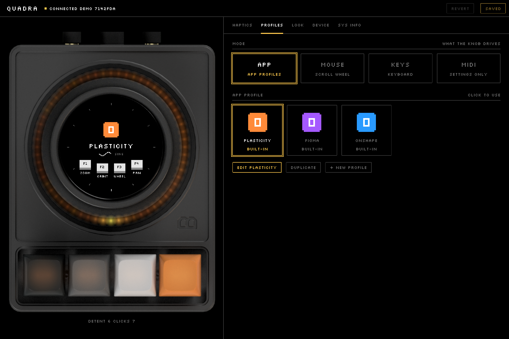

**MODE** is what the knob drives:

| Mode | What the knob does |
|---|---|
| **APP** | Follows an app profile (below) |
| **MOUSE** | Scroll wheel |
| **KEYS** | Keyboard |
| **MIDI** | Stores a MIDI channel only; no MIDI is sent yet |

In **MOUSE** and **KEYS**, **HAPTIC** picks which haptic profile the knob uses in that mode.

In **APP** mode, **APP PROFILE** lists the profiles on the knob with the icons the device
draws. Click one to use it. Under each name is where it comes from:

| Label | Meaning |
|---|---|
| **BUILT-IN** | Part of the firmware, unchanged |
| **BUILT-IN, CHANGED** | A built-in with a stored copy of your edits |
| **YOURS** | A profile you made, stored on the knob |
| **NOT SAVED** | Has edits that are live but not stored |

The buttons act on the selected profile:

- **EDIT** opens it in the editor. Built-ins can be edited too.
- **DUPLICATE** makes a copy and opens it.
- **+ NEW PROFILE** makes an empty one (the knob scrolls, F4 opens the menu) and opens it.

The knob holds up to 16 profiles.

## 6. The profile editor

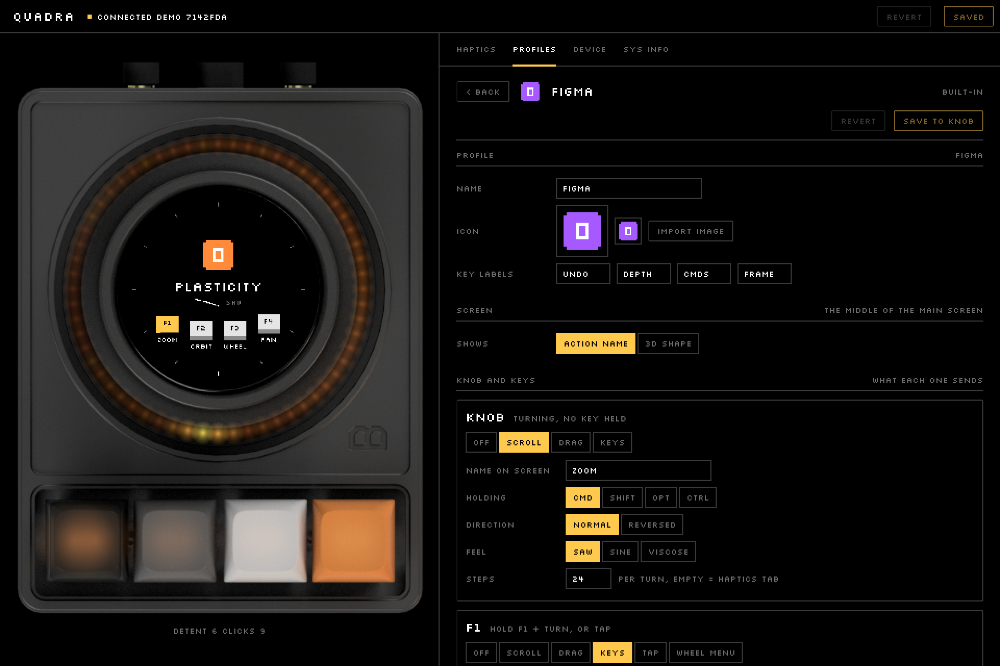

An edit goes to the knob a moment after you make it, so you can try it straight away. The
line under the profile name says where things stand: **LIVE ON THE KNOB, NOT SAVED YET**, or
**SAVED ON THE KNOB**.

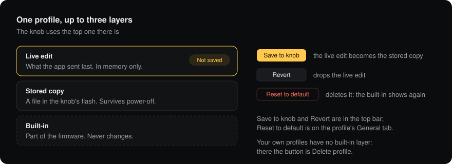

- **SAVE TO KNOB** stores the profile on the knob.
- **REVERT** drops unsaved edits.
- **RESET TO DEFAULT** (at the bottom, for a changed built-in) deletes your stored copy; the
  original shows again.
- **DELETE PROFILE** (at the bottom, for your own profiles) removes it from the knob.
- **< BACK** returns to the list. Your last edit is still sent.

### PROFILE and SCREEN

| Field | What it is |
|---|---|
| **NAME** | Up to 15 characters |
| **ICON** | **IMPORT IMAGE** takes any image and makes the 48 px and 24 px icons the knob draws |
| **KEY LABELS** | The words under F1–F4 on the knob's screen, up to 7 characters each |
| **SHOWS** | The middle of the main screen: the **ACTION NAME**, or a **3D SHAPE** (cube, pyramid or octa, in three styles) that moves as you turn |

### KNOB AND KEYS

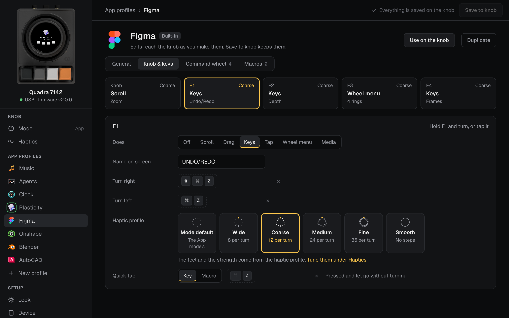

There are five inputs: the **KNOB** turned by itself, and the knob turned while holding **F1**,
**F2**, **F3** or **F4**. Each one is set to one of these:

| Kind | What it sends | Its fields |
|---|---|---|
| **OFF** | Nothing | – |
| **SCROLL** | The scroll wheel | Modifier keys held, direction, feel, steps |
| **DRAG** | A mouse drag | Mouse button, modifier keys, axis, speed, direction, feel |
| **KEYS** | One key combo per step | One for turning right, one for turning left, feel, steps |
| **TAP** | A key combo or a macro on a press (F1–F3) | The key, or the macro |
| **WHEEL MENU** | Opens the command wheel (F1–F3) | Steps |
| **MEDIA** | Media keys: play / pause, next, previous, volume, mute (knob, F1–F3) | The knob: one for each way and the volume step (FINE = a quarter step on a Mac); a key: the one it sends on press |

- **NAME ON SCREEN** is what the knob's screen shows while that input is in use.
- **FEEL** and **STEPS** together choose a haptic profile for that input: VISCOSE uses SMOOTH, and a step count uses the nearest of WIDE, COARSE, MEDIUM and FINE. The feel and tuning then come from that haptic profile.
- **QUICK TAP** (F1–F3) is a key or macro sent when you press and let go without turning.
  It works alongside the turning action of the same key.
- **F4** has no press actions: holding it still opens the knob's menu.

To set a key combo, click the key field and press the keys, or use the CMD / SHIFT / OPT /
CTRL buttons beside it.

### COMMAND WHEEL

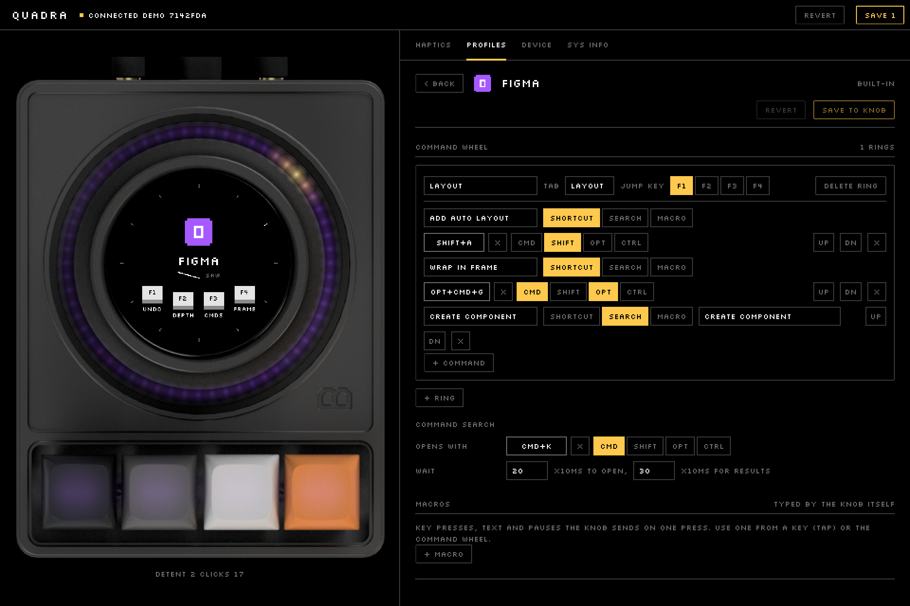

The command wheel appears on the knob while you hold a key set to **WHEEL MENU**: turn to
pick a command, let go to run it. This section shows once a key is set to WHEEL MENU.

- A **ring** is a group of commands, with a **NAME**, a short **TAB** label, and a
  **JUMP KEY** (F1–F4) that jumps to it while the wheel is open. Up to 8 rings.
- A **command** has a name and one of:
  - **SHORTCUT:** a key combo.
  - **SEARCH:** text typed into the app's own command search. **COMMAND SEARCH** below sets
    the shortcut that opens the search and how long to wait for it.
  - **MACRO:** one of the profile's macros.
- **UP**, **DN** and **X** reorder and delete commands. Up to 32 commands in a ring.
- A **CARD** badge means the command has an animated illustration on the knob; **VALUE**
  means it sets a number afterwards. Both are kept as they are, and can't be edited here yet.

## 7. Macros

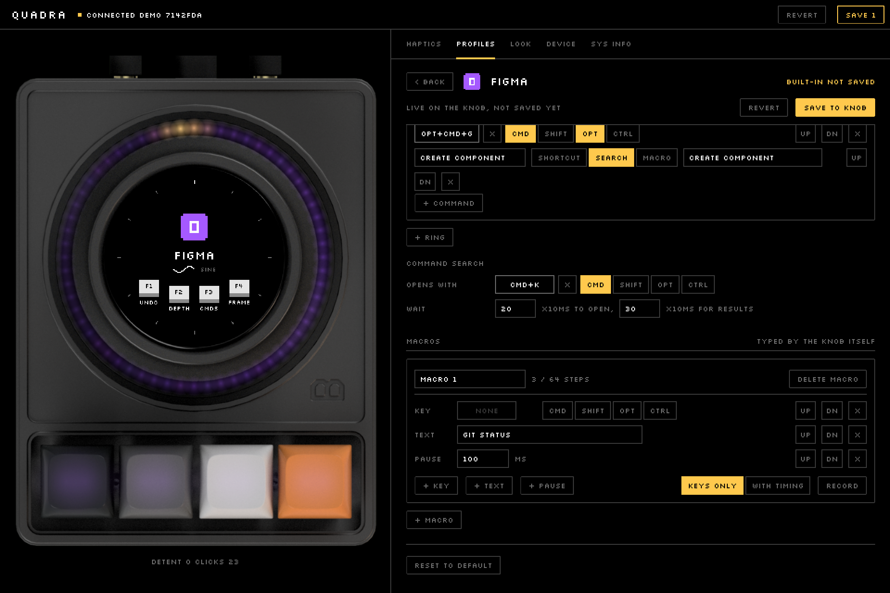

A macro is a list of steps the knob types by itself. It is stored on the knob, so it works
with no app running.

| Step | What it does |
|---|---|
| **KEY** | Presses one key combo |
| **TEXT** | Types text (plain ASCII, up to 120 characters, as US keys) |
| **PAUSE** | Waits, up to 10 seconds |

Build a macro with **+ KEY**, **+ TEXT** and **+ PAUSE**, or record one:

1. Choose **KEYS ONLY**, or **WITH TIMING** to keep the pauses between your key presses.
2. Click **RECORD** and type.
3. Click **STOP**.

Shortcuts the system takes first (Cmd+Q, Cmd+Tab) can't be recorded. Add those with **+ KEY**.

To use a macro, set a key to **TAP** and choose **MACRO**, set a key's **QUICK TAP** to
**MACRO**, or set a command-wheel entry to **MACRO**. Renaming a macro updates the places
that use it; deleting it clears them.

A profile holds up to 16 macros of up to 64 steps each. The knob types about 50 keys a second.

## 8. LOOK

| Section | What it sets |
|---|---|
| **IDLE WORD** | The word on the loading and idle screens, up to 12 characters (lowercase draws as small capitals). Empty = **QUADRA**. Stored on the knob as soon as you press **SET** |
| **COLOR** | The ring and the keys: **APP** (the profile's colours, or the cover's while music plays) or **CUSTOM** with your own **HUE** and **SAT** |
| **EFFECT** | At rest: GRADIENT, SOLID, BREATHE, SPIN, RAINBOW or OFF; **SPEED** for the moving ones; **LEVEL** is the brightness |

LIGHTS are live on the knob while you change them and kept by **SAVE**, like the other settings
(or F2 on the knob's own LIGHTS screen). Changes made on the knob show up here within a second.

**CLOCK** (the CLOCK app): what it shows -- **24 HOUR**, **SECONDS**, **DATE**, and **LED
SECONDS** (the ring sweeps the seconds) -- and up to four zones besides **LOCAL**, which is this
Mac's (the Mac service sends the time and the zone; with WiFi on, the knob also sets its clock
from the internet). Each zone follows its own daylight-saving rules. In the app, turning the
knob steps through the zones; F1 switches 12 / 24 hours, F2 the seconds, F3 the date. Stored on
the knob as you change them.

## 9. DEVICE

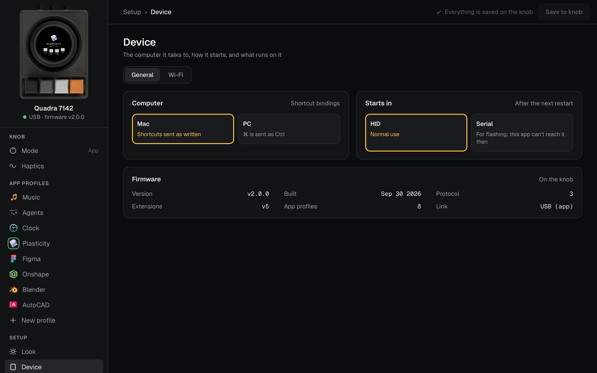

| Section | What it sets |
|---|---|
| **BINDINGS** | The computer on the other end. On **PC**, shortcuts written with Cmd are sent with Ctrl |
| **DISPLAY** | Screen rotation: 0, 90, 180 or 270 degrees |
| **BOOT MODE** | **HID** for normal use, **SERIAL** for flashing. Applies after a restart |
| **WIFI** | The network the knob joins (over USB; the password stays on the knob), its address, and **THIS APP**: **PAIR THIS APP** (see [Connecting](#1-connecting)), **NEW KEY** (press twice: every other paired app has to pair again) and **FORGET** |
| **FIRMWARE** | Version, build date, protocol version, number of profiles, and the link in use (**USB**, **WIFI** or **WEBHID**) |

**Take care with BOOT MODE:** once the knob restarts in SERIAL mode, the companion can't
reach it. Switch back in the knob's own menu: **BOOT MODE → USB MODE → HID**, then restart.

## 10. SYS INFO

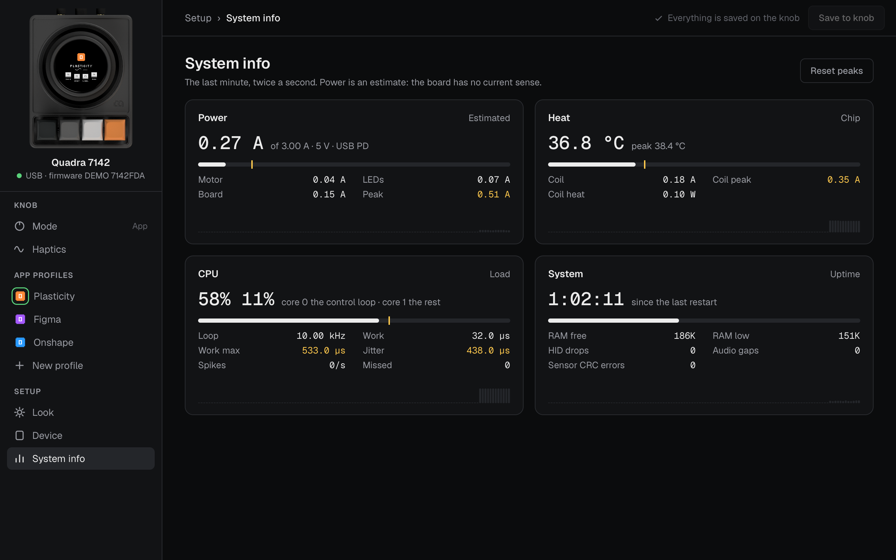

Four tiles, each with a gauge, its numbers, and a chart of the last minute. A tick on a gauge
marks the peak, and **RESET PEAKS** clears the peaks. Amber numbers are peaks, or counters
that should be zero and aren't.

| Tile | What it shows |
|---|---|
| **POWER** | Current drawn, against what the USB port offers; split into motor, LEDs and board. It's an estimate: the board can't measure current |
| **HEAT** | Chip temperature, and the motor coil's current and heating |
| **CPU** | Load on each core. Core 0 runs only the control loop: its rate, work time, jitter, spikes and missed ticks |
| **SYSTEM** | Uptime, free memory, and counters for dropped HID reports, audio gaps and sensor errors |

## 11. When something doesn't work

| What you see | What to do |
|---|---|
| **LOOKING FOR QUADRA** stays | Check the cable. Check the knob is in HID boot mode (knob menu: BOOT MODE) |
| **NO USB ACCESS** (web page) | Open the page in Chrome or Edge, or use the app |
| **CONNECT YOUR QUADRA** (web page) | Click **CONNECT** and pick the knob; the browser asks once |
| The ring in the app doesn't match the real LEDs | The knob's firmware is older than the app and doesn't send its LED colours, so the app draws the ring from the knob's angle. Update the firmware |
| A setting came back after a restart | It wasn't saved. Change it again and press **SAVE** |
| An edit is refused, with a message under the profile name | The message says which field: for example a name that's too long, or text that isn't plain ASCII |
| The profile buttons are greyed out | The knob already holds 16 profiles. Delete one |
