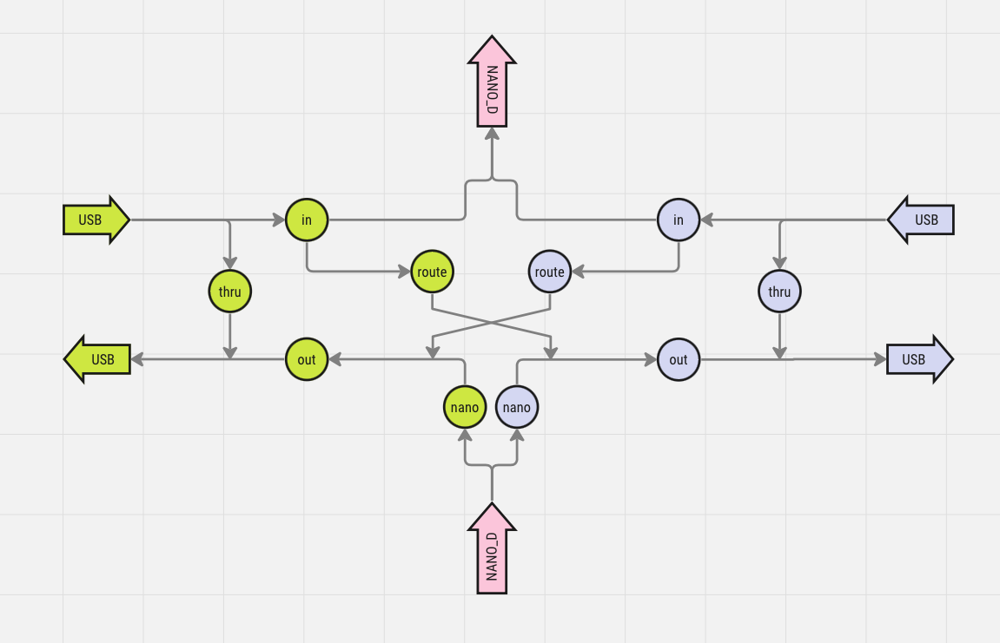

# MIDI device

Your Nano_D++ is a small but capable MIDI device. It has two MIDI interfaces, one on USB and one as mini-jacks for connection to other MIDI hardware. It can route messages between its interfaces and send configurable MIDI messages triggered by its keys or knob.

## MIDI routing

Each circle in the diagramme below represents a software-configurable switch in the digital MIDI router:

## MIDI messages

MIDI messages can be configured on the keys and knob using Zero/One.

Possible messages include:

- MIDI CC message with fixed value
- MIDI CC messages with variable value (set with knob)

TODO screenshots

## Future functionality

Use the Nano_D++ screen to configure midi routing and messages

